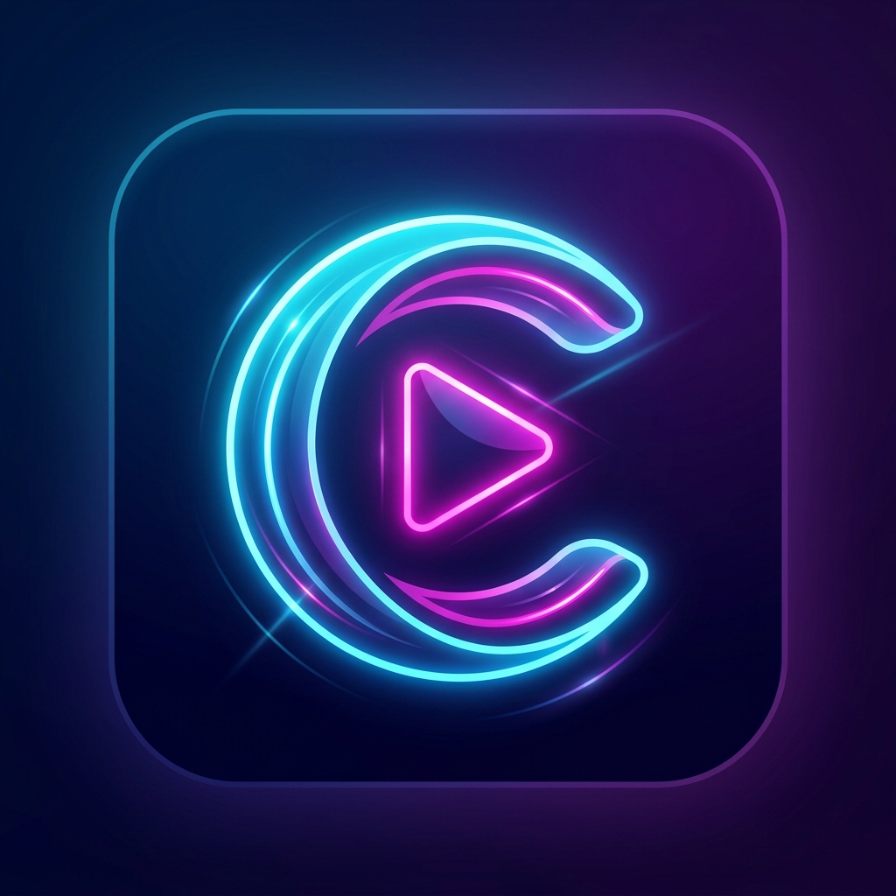

<div align="center">

  

  # OmniBingeVerse
  ### High-Performance Cloudstream 3 Extension Ecosystem

  [](https://github.com/0xOpCode/omnibingeverse/actions/workflows/build.yml)
  [](https://cloudstream.cf/)
  [](https://android.com)
  [](https://github.com/features/actions)
  [](https://github.com/0xOpCode)

  <p align="center">
    <b>A modular, automated repository delivering high-reliability media scrapers, multi-source stream extractors, and content resolvers for Cloudstream 3.</b>
  </p>

  <p align="center">
    <a href="#-quick-installation">Quick Install</a> •
    <a href="#-available-extensions">Extensions</a> •
    <a href="#-architecture--features">Architecture</a> •
    <a href="#-ci-cd-pipeline">CI/CD Pipeline</a> •
    <a href="#-disclaimer">Disclaimer</a>
  </p>

</div>

---

## 📌 Overview

**OmniBingeVerse** (OmniBingeBox) is a production-grade extension repository engineered for the [Cloudstream 3](https://cloudstream.cf/) ecosystem. It provides continuous integration and automated builds for custom Kotlin/Android scrapers, decryptors, and streaming providers, ensuring zero downtime and rapid multi-source failovers.

```
┌─────────────────────────┐       ┌────────────────────────┐       ┌─────────────────────────┐
│  Cloudstream 3 Client   │ ◄───► │ OmniBingeVerse Registry│ ◄───► │ Stream Extractors & API │
│ (Android / Android TV)  │       │      (repo.json)       │       │    (Multi-source Mirrors│
└─────────────────────────┘       └────────────────────────┘       └─────────────────────────┘
```

---

## 🚀 Quick Installation

Adding OmniBingeVerse to your Cloudstream app takes less than a minute.

### Method 1: Repository Shortcode (Recommended)

1. Open **Cloudstream 3** on your Android device or Android TV.
2. Navigate to **Settings** ➔ **Extensions** ➔ **Add Repository**.
3. Paste the following raw manifest URL into the repository field:

```text
https://raw.githubusercontent.com/0xOpCode/omnibingeverse/refs/heads/main/repo.json
```

4. Click **Download** / **Add**. The extensions will now appear in your plugins library ready to install.

---

## 🧩 Available Extensions

| Extension | Target Media | Features & Highlights | Build Status |
| :--- | :--- | :--- | :---: |
| **KissKH (OmniBingeBox)** | Asian Dramas, Anime & Global Cinema | Multi-source mirror resolver, dynamic subtitle loader, rapid stream buffering, token decryption. | `Active` ✅ |
| **OpVerse Mobile** | Regional & Indian Cinema, Web Series | Tailored metadata indexing, categorized search, high-bandwidth HD server fallbacks. | `Active` ✅ |

---

## 🛠️ Architecture & Features

- **Automated CI/CD Pipeline:** Every extension is compiled directly from source using headless Gradle environments (`gradle make makePluginsJson`) on GitHub Actions runners with Java 21 and Android SDK toolchains.
- **Dynamic Plugin Manifest:** Built-in `repo.json` manifest v1 schema compatibility ensures instant updates without requiring app reinstalls.
- **Failover Stream Resolution:** Scrapers implement resilient fallback chains to gracefully bypass broken mirrors and rate-limited endpoints.
- **Optimized for TV & Mobile:** Engineered to respect low memory footprints and fast cold-boot times on both budget Android devices and Android TV boxes.

---

## ⚙️ CI/CD Pipeline

The project utilizes an automated continuous delivery architecture:

1. **Trigger:** Webhook / repository dispatch (`build_extension`) or manual execution via `workflow_dispatch`.
2. **Build Environment:** Ubuntu latest runner, JDK 21 (Temurin), Android SDK platform tools.
3. **Artifact Generation:** Compiles `.cs3` binary bundles and generates dynamic `plugins.json` indices into the dedicated `builds` distribution branch.
4. **Zero Cache Latency:** Published assets are directly served through GitHub's raw CDN edge.

---

## ⚖️ Legal Disclaimer

> [!IMPORTANT]
> This repository does **not** host, store, stream, or distribute any media files, videos, or copyrighted content. 
> 
> OmniBingeVerse only maintains open-source scraper definitions and software scripts that parse publicly accessible, third-party web markup. All media streams are delivered independently by third-party servers. The maintainer assumes no liability for how end-users utilize these tools.

---

## 👨‍💻 Maintainer

Developed and maintained with precision by **[0xOpCode](https://github.com/0xOpCode)**.

[](https://github.com/0xOpCode)
